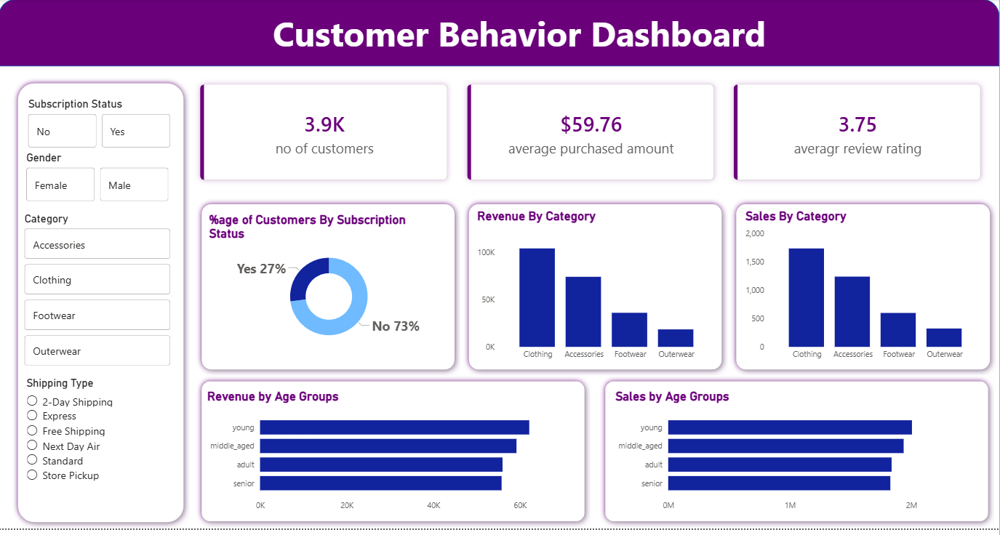

# Customer Behavior Analysis Dashboard

## Overview

This project analyzes customer shopping behavior to uncover patterns in purchasing habits, demographics, and product preferences. The analysis combines **Python for data exploration**, **MySQL for query-based analysis**, and **Power BI for interactive visualization**.

The goal of the project is to transform raw customer transaction data into meaningful insights that can support better business decisions. The project follows a complete **data analytics workflow**, including data loading, exploratory data analysis (EDA), data cleaning, SQL-based analysis, dashboard development, and report creation.

---

# Dataset

The dataset contains customer shopping information including demographic details, product categories, purchase amounts, and transaction attributes.

### Key features in the dataset include:

- Customer ID  
- Age  
- Gender  
- Item Purchased  
- Category  
- Purchase Amount (USD)  
- Location  
- Season  
- Review Rating  
- Shipping Type  
- Subscription Status  
- Discount Applied  
- Promo Code Used  
- Previous Purchases  
- Payment Method  
- Frequency of Purchases  

The dataset is used to understand **customer demographics, spending patterns, and purchasing trends**.

---

# Tools and Technologies

This project uses multiple tools across the data analytics pipeline.

## Python
- Data loading
- Data cleaning
- Exploratory Data Analysis (EDA)

## MySQL
- SQL queries for business analysis
- Aggregation and customer segmentation

## Power BI
- Interactive dashboard
- Data visualization
- KPI tracking

## Jupyter Notebook
- Python analysis environment

## Gamma
- Presentation creation

## GitHub
- Version control and project documentation

---

# Project Workflow

The project follows a structured analytics workflow:

```
Dataset
↓
Data Loading in Python
↓
Data Cleaning
↓
Exploratory Data Analysis (EDA)
↓
SQL Analysis in MySQL
↓
Power BI Dashboard Development
↓
Project Report Creation
↓
Presentation using Gamma
```

---

# Steps Performed

## 1. Data Loading

The dataset was imported into Python using the **Pandas library** for analysis.

---

## 2. Data Cleaning

Data preprocessing was performed to improve data quality. This included:

- Standardizing column names  
- Checking for missing values  
- Ensuring correct data types  
- Preparing the dataset for analysis  

---

## 3. Exploratory Data Analysis (EDA)

EDA was performed to understand the structure and patterns in the dataset.

### Key analyses included:

- Age distribution of customers  
- Purchase amount distribution  
- Product category popularity  
- Payment method usage  
- Seasonal purchasing patterns  

Visualization libraries such as **Matplotlib** and **Seaborn** were used to create charts.

---

## 4. SQL Analysis in MySQL

SQL queries were written to answer business questions such as:

- Revenue generated by different customer groups  
- Impact of discounts on customer spending  
- Top rated products  
- Customer segmentation based on previous purchases  
- Revenue contribution by age group  

These queries helped generate deeper analytical insights from the dataset.

---

## 5. Power BI Dashboard

An interactive dashboard was created in **Power BI** to visualize the results.

### Key dashboard components include:

- Total revenue KPI  
- Category-wise sales  
- Customer demographics  
- Seasonal sales trends  
- Payment method distribution  
- Discount impact analysis  
- Customer loyalty insights  

The dashboard allows users to explore insights interactively.

---

## 6. Project Report

A detailed project report was prepared explaining:

- Project objectives  
- Methodology  
- Data analysis process  
- Dashboard insights  
- Business recommendations  

---

## 7. Presentation

A project presentation was created using **Gamma** to summarize the key findings and demonstrate the dashboard.

---

# Dashboard Preview



The dashboard provides a visual summary of customer purchasing patterns and key business insights.

---

# Key Results and Insights

The analysis revealed several useful insights:

- Certain product categories generate higher revenue than others.  
- Digital payment methods are widely preferred by customers.  
- Discounts and promotional codes increase purchase frequency.  
- Seasonal trends influence purchasing behavior.  
- Customers with higher previous purchases show stronger loyalty.  

These insights can help businesses improve **marketing strategies, product offerings, and customer engagement**.

---

# How to Run the Project

### 1. Clone the repository

```
git clone https://github.com/your-username/customer-behavior-analysis.git
```

### 2. Install required Python libraries

```
pip install pandas matplotlib seaborn
```

### 3. Run the Jupyter Notebook

```
jupyter notebook
```

### 4. Import the dataset into MySQL to run SQL queries.

### 5. Open the Power BI file (`.pbix`) to explore the dashboard.

---

# Author

**Braham Dutt Bhardwaj**  
Aspiring Data Analyst
